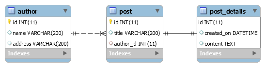

# Demo N+1 problem
Giả sử có 3 table với quan hệ như hình:



Note 1 chút về khai báo Entity cho 3 bảng này:
```java
// Note: @JsonManagedReference Dùng cho entity cha, @JsonBackReference dùng cho entity con
// Nếu ko có 2 annotation đó, thì lúc convert sang json sẽ bị lặp vô tận!
// Note nữa: dùng fetch = FetchType.LAZY cũng chả tránh được N+1 query đâu!

// class Author:
@OneToMany(mappedBy = "author", cascade = CascadeType.ALL)
@JsonManagedReference
private List<Post> posts;

// class Post:
@ManyToOne
@JoinColumn(name = "author_id")
@JsonBackReference
private Author author;

@OneToOne(mappedBy = "post", cascade = CascadeType.ALL)
@PrimaryKeyJoinColumn
@JsonManagedReference
private PostDetails details;

// class PostDetails:
@OneToOne(fetch = FetchType.LAZY)
@JoinColumn(name = "post_id")
@MapsId
@JsonBackReference
private Post post;
```

Data của từng table như sau:
```
author:
+----+------------+----------------+
| id | name       | address        |
+----+------------+----------------+
|  1 | Tuzaku     | Hanoi          |
|  2 | Nguyên Bka | Hanoi, Vietnam |
|  3 | Huyga      | Hanoi          |
|  4 | Toàn tvt   | Bắc Giang      |
+----+------------+----------------+

post:
+----+-------------------------------------------+-----------+
| id | title                                     | author_id |
+----+-------------------------------------------+-----------+
|  1 | First post                                |         1 |
|  2 | Bitcoin is increasing rapidly             |         1 |
|  3 | Trump lần đầu lên tiếng sau khi mãn nhiệm |         2 |
|  4 | Dùng hóa chất ngâm 1,3 tấn thịt ốc        |         1 |
|  5 | Xác hổ hơn 250 kg trong nhà dân           |         2 |
+----+-------------------------------------------+-----------+

post_details:
+---------+---------------------+----------------------+
| post_id | created_on          | content              |
+---------+---------------------+----------------------+
|       1 | 2020-12-21 00:00:00 | This is content demo |
|       2 | 2020-12-23 00:00:00 | This is content demo |
|       3 | 2021-01-23 00:00:00 | This is content demo |
|       4 | 2021-01-24 00:00:00 | This is content demo |
|       5 | 2021-01-26 00:00:00 | This is content demo |
+---------+---------------------+----------------------+
```

Ở hình trên (và cũng trong project này): Table Post có quan hệ n-1 với Author, và quan hệ 1-1 với PostDetails. Xét API sau: http://localhost:9019/boot-nplusone/api/post

API trên sẽ gọi method ```postRepository.findAll();``` của JPA. Và do Post có quan hệ với 2 table khác, nên nó sẽ gen ra thêm 1 đống câu query như sau:

Đầu tiên là **1 query** get all post:
```sql
select
    post0_.id as id1_1_,
    post0_.author_id as author_i3_1_,
    post0_.title as title2_1_ 
from
    post post0_
```

Query trên lấy được 5 record, để ý rằng 5 record này có 2 author (id = 1, 2), nên Hibernate sẽ tạo **2 query** nữa để lấy data từ bảng author ứng với author.id = 1, 2:
```sql
select
    author0_.id as id1_0_0_,
    author0_.address as address2_0_0_,
    author0_.name as name3_0_0_ 
from
    author author0_ 
where
    author0_.id=?;
```

Chưa hết, do mỗi post đều có 1 post_details tương ứng, nên Hibernate lại tạo thêm **5 query** nữa trên bảng post_details ứng với post_details.post_id = [1, 5]:
```sql
select
    postdetail0_.post_id as post_id1_2_0_,
    postdetail0_.content as content2_2_0_,
    postdetail0_.created_on as created_3_2_0_ 
from
    post_details postdetail0_ 
where
    postdetail0_.post_id=?
```

Như vậy tổng cộng Hibernate đã sinh ra 8 câu query! Đó chính là N+1 problem (7 câu query sinh ra để select trên bảng khác có quan hệ với bảng được select). Tất nhiên khi API cần trả về tất cả info liên quan đến post (author là ai, content là gì...) thì việc select thêm đó là đúng (mặc dù số lượng query là nhiều và thừa)! Nhưng nếu trường hợp ta chỉ muốn lấy title của tất cả các post thôi chẳng hạn, thì việc lấy thêm info author, content là thừa. Trường hợp này có viết query chỉ select mỗi title thôi, thì nó sẽ ko sinh ra 7 query trên 2 bảng kia nữa:
```java
@Query("SELECT p.id AS id, p.title AS title FROM Post p")
List<Map<String, Object>> getPostTitles();
```

Hoặc nếu muốn lấy cả author, content thì cũng viết query là được:
```java
@Query("SELECT p.id AS id, p.title AS title, p.author.name AS author, p.details.content AS content " + 
        "FROM Post p ")
List<Map<String, Object>> getPostDetails();
```

VD khác: get all author: ```authorRepository.findAll();```

Có 4 author trong db, nên Hibernate sẽ tự gen ra thêm 4 query để select 4 post tương ướng với 4 author có id = [1, 4]:
```sql
select
    posts0_.author_id as author_i3_1_0_,
    posts0_.id as id1_1_0_,
    posts0_.id as id1_1_1_,
    posts0_.author_id as author_i3_1_1_,
    posts0_.title as title2_1_1_,
    postdetail1_.post_id as post_id1_2_2_,
    postdetail1_.content as content2_2_2_,
    postdetail1_.created_on as created_3_2_2_ 
from
    post posts0_ 
left outer join
    post_details postdetail1_ 
        on posts0_.id=postdetail1_.post_id 
where
    posts0_.author_id=?
```

Ghê quá, nó còn join với cả post_details nữa để lấy tất cả các field từ 3 bảng này! Khắc phục sao đây? Có thể bỏ quan hệ OneToMany đi, vì thường thì entity cha ko cần thiết phải gọi tất cả thằng con làm gì
```java
// class Author: bỏ field này đi
@OneToMany(fetch = FetchType.LAZY, mappedBy = "author", cascade = CascadeType.ALL)
@JsonManagedReference
private List<Post> posts;
``` 

# Swagger local:
http://localhost:9019/boot-nplusone/swagger-ui.html

